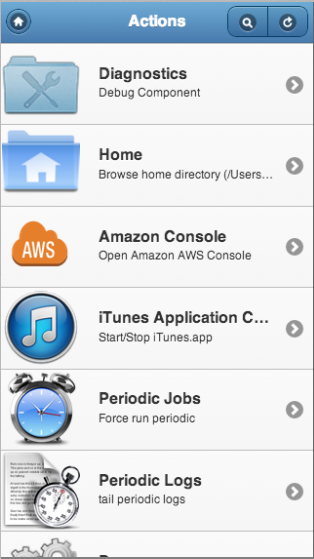

Winifred
========

A mobile web client for automating tasks on a remote machine.

This is a project I wrote when I was beginning learning about html5
mobile development and ( to a lesser extend) beginning with Ruby.

I've been using since then to control the Mac upstairs when I am
downstairs or out of the house. It's useful, but only on OSX, only
on Mavericks and, realistically, only in my house.

So I figured I would keep it on Github and see if I can clean it
up a bit and myabe make it a bit more generally useful.

The idea came when I was writing workflows in Alfred
(http://www.alfredapp.com/) and I wanted to be able to do something
from a mobile device.  It's called Winifred because it's inspired
by Alfred but that's where the similarity ends.

Client
======

The client is  single page written in Jquery Mobile. The routing
model in JQM didn't really work for this  (JQM prefers to navigate
to a page and then fetch from the server but in this case the "page"
to show depends on the results that are fetched) so the client code
intercepts all the links and just hides/shows the appropriate bit
of UI depending on if the fetch results in another menu, a file
that has actions or a file contents.

A migration to use Backbone.Router would allow the URL to reflect the
state and arguments passed to the server API which would make history and back
buttons etc work.

Server
======

The server is a Ruby/Rack server it serves up the client files (via
ERB in some cases) and provides an API endpoint.

The server loads a collection of workflows from workflows.yaml.
Each workflow which doe not require an argument becomes a top-level
menu item in the client. Workflows requiring an argument can only
be called from another workflow.

Each workflow is implement by a "component" which is a ruby class.
The component gets passed a query argument and returns JSON to
represent, either, the next set of menu options or another component.
The components are inteded to be general purpose items that can be
specialised. For example the scriptfilter component takes the name
of a shell script to call and converts the 
results into JSON for the client.  The OpenUrl component takes a
url template and opens the query.

Security
========

Since the primary use is to quickly restart iTunes or check a logfile
I wanted to be able to log in without a password across my WIFI or
from work.

I found I could generate my own Certificate Authority (CA) and issue
client certificates, which can be emailed to my phone and installed.
Then the communication will be encrypted and I don't have to enter
a password.

This is only partially implemented as a set of bash scripts that
generate the various certs/keys.  I plan to convert these to ruby
and run a registration server that can be used to register a client.

